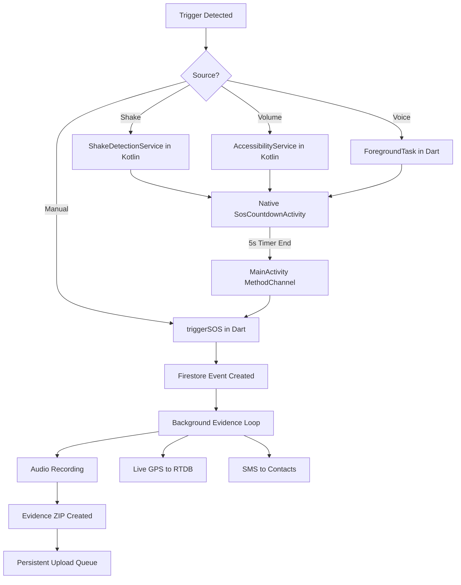

# Nari Shakti: Technical Architecture & Implementation Overview

This document provides a comprehensive technical breakdown of the **Nari Shakti** application, designed for rapid SOS response and evidence preservation.

---

## 1. Project Tech Stack

- **Framework**: [Flutter](https://flutter.dev/) (UI & Logic Layer)
- **Native Implementation**: [Kotlin](https://kotlinlang.org/) (Low-level Android Hardware Triggers)
- **Backend/Database**: 
    - **Firebase Auth**: User identity management.
    - **Firebase Firestore**: SOS event logs, user profiles, and emergency contacts.
    - **Firebase Realtime Database**: High-frequency live location tracking during emergencies.
- **Storage/Evidence**:
    - **Firebase Storage**: Backup for smaller evidence files.
    - **Cloudinary/External HTTP**: High-reliability manual ZIP uploads for forensic evidence.
- **Maps Infrastructure**: Google Maps Platform (Android SDK).

---

## 2. Core Architecture & Logic Flow

The app operates on a **Hybrid Service Architecture**. While most of the logic lives in Flutter (Dart), the "Guardian" triggers are implemented natively in Kotlin to bypass the strict limitations Android places on background apps.

### High-Level SOS Workflow

---

## 3. Detailed Feature Implementation

### A. SOS Trigger Mechanisms

#### 1. Manual Activation
- **File**: `lib/screens/home/home_screen.dart`
- **Logic**: Uses a high-responsiveness `onTapDown` gesture on the SOS button to instantly fire `SosService().triggerSOS()`.

#### 2. Shake Detection (Universal)
- **Native File**: `android/app/src/main/kotlin/com/example/nari_shakti/ShakeDetectionForegroundService.kt`
- **Technicality**: Uses a dedicated `ForegroundService` with a `SensorEventListener` to monitor the accelerometer even when the app is closed. It employs a **multi-stage bypass** (Full-Screen Intent + Overlay Permission) to rip the SOS UI over the lock screen

#### 3. Hardware Volume Trigger (5x Volume Down)
- **Native File**: `android/app/src/main/kotlin/com/example/nari_shakti/VolumeButtonAccessibilityService.kt`
- **Technicality**: Implements an `AccessibilityService` to listen for global key events. It counts exactly 5 `KEYCODE_VOLUME_DOWN` presses within 3000ms. If matched, it fires the same high-priority UI launch sequence as the Shake service.

#### 4. Voice Trigger ("Bachao" / "Help Me")
- **File**: `lib/core/services/protection_service.dart`
- **Technicality**: Uses `speech_to_text` within a `flutter_foreground_task` to listen for specific keywords in a continuous loop.

---

### B. The "Lock Screen Pierce" Maneuver
A critical safety feature of Nari Shakti is the ability to show the UI over the lock screen.
- **Files**: `MainActivity.kt`, `SosCountdownActivity.kt`
- **Methods used**: 
    - `setShowWhenLocked(true)`
    - `setTurnScreenOn(true)`
    - `WindowManager.LayoutParams.FLAG_DISMISS_KEYGUARD` 
- **Purpose**: This allows the user to press "I'm Safe" and allows the camera hardware to initialize even if the phone is locked.

---

### C. Evidence Collection & Preservation
- **Service**: `lib/core/services/evidence_service.dart`
- **Process**:
    1. **Audio**: Uses `record` package to capture ambient sounds.
    2. **Location**: Uses `geolocator` for GPS and `firebase_database` for sub-second live tracking.
    3. **SMS**: Uses a custom `MethodChannel` to `SmsManager.getDefault()` in Kotlin to ensure SMS sends even without a UI.
    4. **Packaging**: Uses `archive` to zip all evidence (audio, logs, location) locally.

---

### D. Background Upload Queue (Reliability)
- **Service**: `lib/core/services/upload_queue_service.dart`
- **Strategy**: 
    - If the internet is down, the ZIP path is saved to `shared_preferences`.
    - A `periodic` timer (currently set to 1 minute) scans for pending jobs.
    - Uses `connectivity_plus` to detect network restoration and instantly flush the queue.

---

## 4. Key Flutter Packages & Purpose

| Package | Purpose |
| :--- | :--- |
| `firebase_core/auth/firestore` | Backend infrastructure and database. |
| `firebase_database` | **Crucial**: Used for real-time live location tracking for the safety map. |
| `geolocator` | Fetching high-accuracy GPS coordinates for the SOS alert. |
| `permission_handler` | Managing the complex matrix of Android permissions (Overlay, Accessibility, Location). |
| `flutter_foreground_task` | Keeps the app logic alive in the background for voice detection. |
| `sensors_plus` | Fallback shake detection within the Dart layer. |
| `record` | High-performance audio recording for evidence gathering. |
| `connectivity_plus` | Monitoring internet status to retry failed cloud uploads. |
| `archive` | Bundling multiple files into a single forensic ZIP for easier transmission. |

---

## 5. Summary for Round Reviewers

Nari Shakti stands out because it doesn't just rely on a button. It acknowledges that in a real emergency, a user might not be able to unlock their phone. By utilizing **Android Accessibility Services** and **Foreground Native Sensors**, we've built an app that "lives" on the device hardware, ensuring that whether through a shake, a voice command, or a physical button press, help is never more than 3 seconds away.
